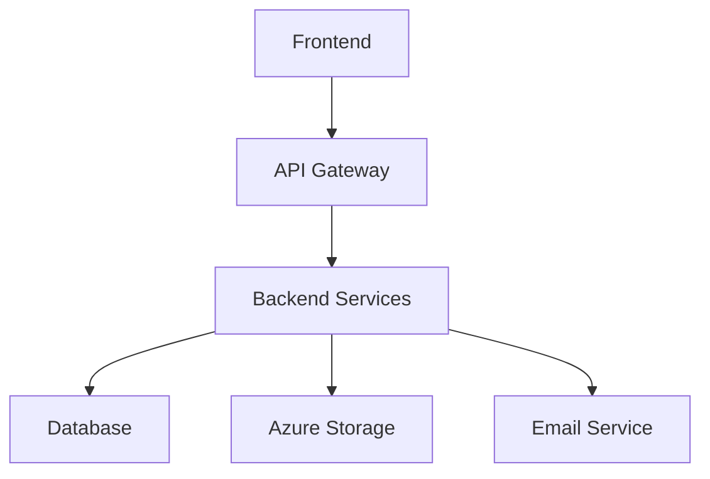

# Radical Zero Carbon Calculator - System Architecture

## System Overview

The Radical Zero Carbon Calculator is built using a modern, multi-environment architecture that ensures separation of concerns, scalability, and maintainability.

## Environment Structure

### 1. Frontend Environment
**Location**: `/client`
**Technology Stack**: React + TypeScript
**Key Components**:
- Multi-step Calculator Form
- Document Upload Interface
- Results Dashboard
- User Authentication UI
- Interactive Visualizations

**Key Features**:
- Client-side form validation
- Real-time calculations
- Responsive design
- Framer Motion animations
- PDF document processing

### 2. Backend Environment
**Location**: `/server`
**Technology Stack**: Express.js + TypeScript
**Key Components**:
- RESTful API Routes
- Authentication Services
- Document Processing Service
- Email Service
- Storage Service

**Microservices**:
- Carbon Credit Calculator Service
- Document Analysis Service
- Email Notification Service
- User Management Service

### 3. Database Environment
**Technology**: PostgreSQL
**Key Components**:
- User Data Store
- Submissions Storage
- Authentication Records
- Analytics Data

### 4. Cloud Storage Environment
**Technology**: Azure Blob Storage
**Purpose**: 
- Document Storage
- File Management
- Backup System

## Component Integration

### API Integration Layer


### Data Flow
1. **User Input Flow**:
   ```
   Frontend Form → API Gateway → Backend Validation → Database Storage
   ```

2. **Document Processing Flow**:
   ```
   Document Upload → Azure Blob Storage → Document Analysis → Database Storage
   ```

3. **Calculation Flow**:
   ```
   User Input → Calculator Service → Results Generation → Email Service
   ```

## Environment Communication

### Inter-Service Communication
- RESTful APIs for service-to-service communication
- WebSocket connections for real-time updates
- Event-driven architecture for asynchronous operations

### Security Layer
Each environment is protected by:
- CORS policies
- JWT authentication
- Rate limiting
- Input validation
- SQL injection prevention

## Configuration Management

### Development Environment
```typescript
{
  "env": "development",
  "api": {
    "baseUrl": "http://localhost:5000",
    "timeout": 30000
  },
  "database": {
    "logging": true,
    "synchronize": true
  }
}
```

### Production Environment
```typescript
{
  "env": "production",
  "api": {
    "baseUrl": "https://api.radicalzero.com",
    "timeout": 30000
  },
  "database": {
    "logging": false,
    "synchronize": false
  }
}
```

## Deployment Architecture

### Frontend Deployment
- Hosted on Replit
- CDN integration for static assets
- Client-side caching
- Service Worker implementation

### Backend Deployment
- Node.js runtime on Replit
- Load balancing
- Auto-scaling capabilities
- Health monitoring

### Database Deployment
- PostgreSQL instance
- Connection pooling
- Automated backups
- Disaster recovery

## Monitoring and Logging

### Application Monitoring
- Error tracking
- Performance metrics
- User analytics
- System health checks

### Logging Strategy
- Centralized logging
- Log levels (DEBUG, INFO, WARN, ERROR)
- Request/Response logging
- Performance logging

## Security Measures

### Authentication
- JWT-based authentication
- Session management
- Password hashing
- 2FA support (planned)

### Data Protection
- GDPR compliance
- Data encryption
- Secure communication
- Regular security audits

## Scaling Strategy

### Horizontal Scaling
- Stateless architecture
- Load balancer configuration
- Database replication
- Cache layer implementation

### Vertical Scaling
- Resource optimization
- Performance tuning
- Memory management
- CPU utilization

## Disaster Recovery

### Backup Strategy
- Daily database backups
- Document versioning
- System state snapshots
- Recovery procedures

### High Availability
- Multiple availability zones
- Failover mechanisms
- Data replication
- Service redundancy

## Development Workflow

### Local Development
1. Frontend development server
2. Backend API server
3. Local database instance
4. Mock services

### Testing Environment
1. Automated testing
2. Integration testing
3. Performance testing
4. Security testing

## Future Considerations

### Planned Improvements
- Microservices architecture
- Container orchestration
- AI/ML integration
- Advanced analytics

### Scalability Plans
- Global CDN
- Multi-region deployment
- Enhanced caching
- Performance optimization

## Documentation Standards

### API Documentation
- OpenAPI/Swagger specifications
- Endpoint documentation
- Request/Response examples
- Error handling

### Code Documentation
- TypeScript types
- JSDoc comments
- Component documentation
- Architecture decisions

## Version Control Strategy

### Repository Structure
```
radical-zero/
├── client/           # Frontend application
├── server/           # Backend services
├── shared/           # Shared utilities
├── docs/             # Documentation
└── scripts/          # Development scripts
```

### Branching Strategy
- main: Production branch
- develop: Development branch
- feature/*: Feature branches
- hotfix/*: Hotfix branches

## Conclusion

This architecture document serves as a comprehensive guide for understanding the system's structure, components, and interactions. It should be updated as the system evolves and new features are added.
